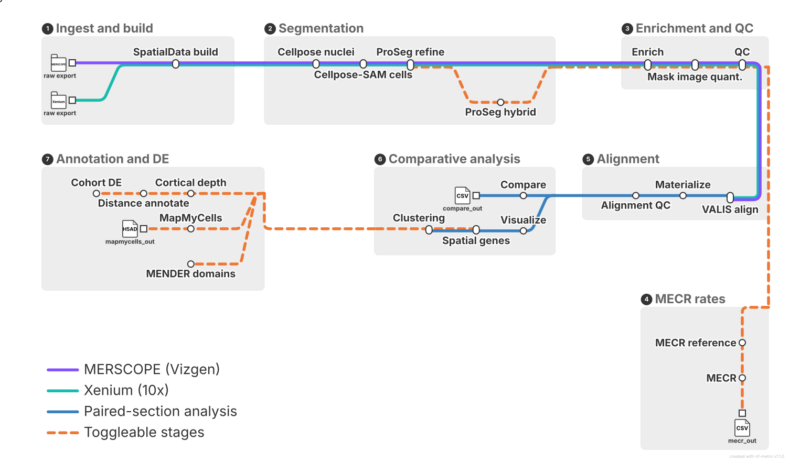

<div align="center">


**Pre-processing, segmentation, and comparative or individual analysis of MERSCOPE and Xenium spatial transcriptomics datasets.**

[](https://github.com/bourdenxlab/MerXen/actions/workflows/ci.yml)
[](https://www.nextflow.io/)
[](https://www.python.org/)
[](LICENSE)
[](https://github.com/astral-sh/ruff)

</div>

<h2 align="center">Pipeline workflow</h2>

<br>



## Overview

The MerXen pipeline was designed to enable standardised analysis of MERSCOPE and Xenium datasets collected from brain tissue sections. MerXen allows for either standalone analysis of data from either one of these two spatial transcriptomic platforms, or for direct comparative analysis.

Human datasets are the default. Mouse datasets use the same pipeline with
`--species mouse`; this selects mouse-safe stage defaults and the Allen Whole
Mouse Brain reference where applicable.

In the comparative analysis mode, pairs of adjacent brain tissue sections, one run on Vizgen **MERSCOPE** and the other on 10x Genomics **Xenium**, using the *same* gene panel are analysed together. MerXen re-derives cell boundaries from the raw imagery and transcripts on both platforms, brings the two sections into a common coordinate system, and runs an identical downstream analysis on each — so the differences measured are platform differences, not data processing difference from the pipelines provided by the two vendors.

By default every samplesheet row is a paired experiment, but the same workflow runs single-platform with `--analysis_mode merscope` or `--analysis_mode xenium`. In either mode, multiple samples can be run at once with the same parameters, each undergoing segmentation, per-cell image quantification, QC, cell-type assignment and an array of optional downstream analysis stages.

### Highlights

- **Segmentation from scratch, optimised for brain tissue.** Cellpose-SAM nuclei and cell segmentation, refined by ProSeg 3.2.0 transcript based segmentation using Cellpose as a prior — so both platforms derive cell boundaries in the same way.
- **Matched downstream stages.** Every analysis after ingest is platform-agnostic and runs identically on MERSCOPE and Xenium, including against the original instrument segmentations for direct comparison.
- **Cross-section registration.** Optional VALIS DAPI-morphology alignment puts adjacent sections in one coordinate system, with its own post-alignment QC.
- **Reproducible by construction.** Nextflow processes, isolated conda environments per conflicting stage, pinned lockfiles to reproduce the same analysis on any system with sufficient computing resources.

## Requirements

| Requirement | Notes |
|---|---|
| **Linux** | The pipeline is developed and tested on Linux. It may not run on macOS or Windows as-is and hasn't been tested on these platforms. |
| [Nextflow](https://www.nextflow.io/docs/latest/getstarted.html) `>=23.04` | On your `PATH`. |
| [Conda](https://docs.conda.io/) or [Miniforge](https://github.com/conda-forge/miniforge) | Creates the `merxen` environment and the isolated per-stage environments. |
| Rust/Cargo **or** a ProSeg 3.2.0 binary | MerXen searches `/usr/bin`, `/usr/local/bin`, then `command -v proseg`, and builds the pinned revision with Cargo if none is found. |
| NVIDIA GPU | Strongly recommended. Cellpose-SAM falls back to CPU (`--cellpose_gpu false`) but is very slow on full sections. |
| Substantial RAM | Individual segmentation processes request up to **220 GB**. See [Configuration](docs/configuration.md#resource-limits) to dial requests down. |

## Quickstart

```bash
git clone https://github.com/bourdenxlab/MerXen.git
cd MerXen

# 1. Environment (installs Python 3.12 and the merxen CLI)
conda env create -f envs/environment.yml
conda activate merxen

# 2. Environment variables
cp .env.example .env

# 3. Samplesheet — edit with your own dataset paths
cp workflows/samplesheet.example.csv workflows/samplesheet.csv

# 4. Run
nextflow run workflows/main.nf \
    --samplesheet workflows/samplesheet.csv \
    --outdir ./results
```

Full walkthrough: [Getting started](docs/getting-started.md).

## Pipeline stages

Each stage is one Nextflow module and one `merxen` subcommand, sharing a Pydantic config contract.

| Stage | What it does | Default |
|---|---|---|
| [SpatialData build](docs/stages/spatialdata-build.md) | Builds platform-specific SpatialData zarrs from raw MERSCOPE and Xenium output folders | always |
| [Segmentation](docs/stages/segmentation.md) | DAPI-only Cellpose nuclei → GPU Cellpose-SAM cells → ProSeg 3.2.0 refinement from Cellpose logits | always |
| [Segmentation — hybrid](docs/stages/segmentation.md) | Transcript-supported local-convex branch with growth-only boundary smoothing | on (`proseg_hybrid_enabled`) |
| [Enrichment](docs/stages/enrichment.md) | Shape layers and per-shape gene tables | always |
| [Mask image quantification](docs/stages/mask-image-quantification.md) | Quantifies every SpatialData image channel over the final Cellpose masks | always |
| [Cortical depth](docs/stages/cortical-depth.md) | Laplace / equal-area cortical-depth coordinates from boundary annotations | off (`--cortical_depth_enabled`) |
| [QC](docs/stages/qc.md) | Per-dataset geometry and transcript-assignment metrics | always |
| [MECR](docs/stages/mecr.md) | Reference-based mutually exclusive co-expression rate against the species-matched whole-brain atlas | human: on; mouse: opt-in |
| [Alignment](docs/stages/alignment.md) | VALIS DAPI registration, aligned-output materialization, and QC for paired adjacent sections | off (`--enable_alignment`) |
| [Comparison](docs/stages/comparison.md) | Cross-platform gene-level comparison | paired rows only |
| [Visualization](docs/stages/visualization.md) | Single-platform or paired figure generation | always |
| [Spatial gene analysis](docs/stages/spatial-gene-analysis.md) | Cell-level spatial autocorrelation and assignment-independent transcript-coordinate patterns | always |
| [Squidpy clustering](docs/stages/clustering-squidpy.md) | First-pass Scanpy/Squidpy clustering (RAPIDS-backed) | always |
| [MENDER](docs/stages/mender.md) | Independent CPU-only MENDER spatial-domain analysis | off (`--mender_enabled`) |
| [MapMyCells](docs/stages/mapmycells.md) | Local Allen Institute MapMyCells cell type assignment | off (past default `stop_stage`) |
| [Distance from object](docs/stages/distance-from-object.md) | Nearest registered polygon-edge annotation and grey-matter paired near-vs-far PyDESeq2 | off (`--distance_from_object_enabled`) |

Downstream analysis runs for all four segmentation branches by default (`--analysis_segmentation all`): ProSeg-resegmented cells, original instrument segmentations, the Cellpose mask, and the ProSeg hybrid. Use `both` explicitly to restrict analysis to `reseg` and `original_seg`.

See [Metro map](docs/metro-map.md) for what the diagram above does and does not show, and [Pipeline architecture](docs/pipeline.md) for the precise stage graph.

## Key parameters

| Flag | Default | Description |
|---|---|---|
| `--samplesheet` | *required* | Path to your CSV. |
| `--outdir` | `./results` | Where all outputs are published. |
| `--species` | `human` | Dataset species: `human` or `mouse`. Mouse mode selects WMB references for hierarchical clustering, MECR, and MapMyCells. |
| `--analysis_mode` | `paired` | `paired`, `merscope`, or `xenium`. Controls which columns are required and which stages are active. |
| `--analysis_segmentation` | `all` | `all`, `both`, `reseg`, `original_seg`, `proseg_mask`, or `proseg_hybrid`. |
| `--enable_alignment` | `false` | Run VALIS alignment and alignment QC before comparison. Paired mode only; VALIS requires both platform-specific combined pia/tissue-edge annotation GeoJSON columns. |
| `--alignment_backend` | `valis` | `valis`, or `legacy_spateo` for the former expression-based implementation. |
| `--start_stage` / `--stop_stage` | `build_spatialdata` / `clustering_squidpy` | Run a contiguous stage range. |
| `--only_stage` | — | Alias for setting `start_stage` and `stop_stage` to the same value. |
| `--cellpose_gpu` | profile-dependent | Set `false` to force CPU segmentation. |

Most of these can also be set **per samplesheet row** — a non-empty cell overrides the command-line value for that row only. Full parameter reference: [Configuration](docs/configuration.md).

## Execution profiles

> [!IMPORTANT]
> Nextflow selects the reserved `standard` profile when no `-profile` flag is given, and MerXen maps `standard` to the `dwight` workstation config. Passing **any** explicit profile suppresses `standard`, so `-profile conda` alone drops Dwight's executor capacity, concurrency guards, GPU locking, and reference paths. Combine them: `-profile dwight,conda`.

| Profile | Purpose |
|---|---|
| `standard` / `dwight` | Dwight workstation: 72 CPUs / 640 GB local executor, concurrency guards, shared GPU lock, local reference paths. |
| `conda` | Resolves each process against the repository's conda environments. |
| `apptainer` | Runs every process in the prebuilt CUDA 12.6 container. |
| `gpu` | Adds `--nv` to the GPU-bound processes only, keeping CPU-only containers GPU-free. |
| `azure_slurm_hpc` | SLURM executor, `htc` queue, 24 h wall time. |
| `local` | Dwight settings under the local executor. |

Other hosts must supply their own executor capacity, concurrency limits, GPU handling, and reference paths. More in [Running the pipeline](docs/running-the-pipeline.md).

## Samplesheet

Each row points at raw platform folders, with optional reusable SpatialData cache paths and per-platform channel, z-range, and voxel-layer settings. Row-level columns can override most run defaults for a single sample, and object-distance runs supply registered object GeoJSON paths per platform. In single-platform rows, only the selected platform's columns are required.

For raw MERSCOPE data, set `merscope_z_range` explicitly from plane `1`
(for example, `1-7`): plane `0` is the fiducial-bead layer and will contaminate
the max projection. Xenium morphology images are already projected and are not
affected by this setting.

A template lives at [workflows/samplesheet.example.csv](workflows/samplesheet.example.csv). The full schema, validation rules, and worked examples are in [Samplesheet format](docs/samplesheet.md).

## Outputs

```
results/
├── nextflow/                  # report.html, timeline.html, trace.tsv
├── mecr_reference/            # Shared MECR marker discovery
├── <pair_id>/
│   ├── merscope/              # spatialdata, segmentation, enrichment, …
│   ├── xenium/                # …same stages, run independently
│   ├── alignment/             # registration bundle
│   ├── alignment_materialization/ # reconciliation summary
│   ├── alignment_qc/
│   ├── reseg/                 # mecr, comparison, visualization, clustering, …
│   └── original_seg/          # …the same analyses on instrument segmentations
└── distance_from_object/      # Cohort-level paired DE
```

Every `.png` is also written as a same-stem `.pdf`. Nextflow's own `./work/` directory is cache state, not output — deletable between full runs, but required for `-resume`. Every directory and file is documented in [Outputs](docs/outputs.md).

## Documentation

Full documentation lives in [docs/](docs/) — start at [docs/index.md](docs/index.md).

- **Usage** — [Getting started](docs/getting-started.md) · [Samplesheet format](docs/samplesheet.md) · [Running the pipeline](docs/running-the-pipeline.md) · [Configuration](docs/configuration.md) · [Outputs](docs/outputs.md)
- **Developer reference** — [Pipeline architecture](docs/pipeline.md) · [Metro map](docs/metro-map.md) · [Python API](docs/python-api.md) · [CLI reference](docs/cli.md) · [Development workflow](docs/development.md)

<details>
<summary><b>Repository layout</b></summary>

```
MerXen/
├── workflows/                  # Nextflow pipeline
│   ├── main.nf                 # DSL2 entry point
│   ├── nextflow.config         # Parameters, executor, per-process resources
│   ├── conf/                   # Per-host profile configs
│   └── modules/                # One .nf module per pipeline stage
├── src/merxen/                 # Installable Python package
│   ├── config.py               # Pydantic configs (pipeline contract)
│   ├── cli/                    # Click entry points (one per stage)
│   ├── io/                     # Samplesheet, SpatialData builders, image/transcript I/O
│   ├── segmentation/           # Cellpose tiling + ProSeg subprocess
│   ├── enrichment/             # Shape layers + per-shape gene tables
│   ├── qc/                     # Per-dataset and cross-platform metrics
│   ├── analysis/               # Scanpy/Squidpy downstream analyses
│   ├── visualization/          # Plotting
│   ├── cortical_depth/         # Laplace/equal-area depth coordinates
│   ├── distance_from_object/   # Polygon-edge distance + paired pseudobulk DE
│   └── alignment/              # Default VALIS DAPI + legacy Spateo registration
├── tests/                      # pytest suite, mirrors src/merxen/
├── docs/                       # Project documentation (start at docs/index.md)
├── notebooks/                  # Exploratory notebooks only
├── envs/                       # Base env + isolated alignment / clustering-GPU / MENDER envs
├── containers/                 # Base, clustering-GPU and MENDER image definitions
├── requirements*.lock          # Pinned dependency trees
└── Agents.md                   # Project standards (must-read for contributors)
```

Stages with conflicting dependency stacks run in their own environments: `envs/environment.alignment.yml` pins the VALIS 1.2 image-registration stack for `ALIGN`, `envs/environment.clustering-gpu.yml` provides RAPIDS, and `envs/environment.mender.yml` isolates MENDER's AnnData 0.9 / Scanpy 1.9 requirement. Everything else uses `envs/environment.yml`.

</details>

## Contributing

Project standards — layout, dependencies, naming, type hints, docstrings, git workflow, commit prefixes — are defined in [Agents.md](Agents.md) and apply to human and AI contributors alike. Do not commit to `main`; use a feature branch and open a PR.

```bash
pre-commit install
pre-commit install --hook-type pre-push

ruff check . --fix && ruff format .   # lint and format
mypy src/                             # type check
pytest                                # fast tests (excludes slow)
pytest --run-slow                     # include slow integration tests
scripts/run_ci_checks.sh              # the same lockfile-backed checks as CI
```

Day-to-day mechanics — testing, hooks, CI, debugging, adding a new pipeline stage — are in [Development workflow](docs/development.md).

## Built on

MerXen orchestrates the work of a lot of other people. If you use this pipeline, please cite their works:

**Core pipeline** —
[Nextflow](https://www.nextflow.io/) ·
[Cellpose](https://github.com/MouseLand/cellpose) ·
[ProSeg](https://github.com/dcjones/proseg) ·
[SpatialData](https://github.com/scverse/spatialdata) ·
[Scanpy](https://github.com/scverse/scanpy) ·
[Squidpy](https://github.com/scverse/squidpy)

**Optional stages** —
[VALIS](https://github.com/MathOnco/valis) ·
[PyDESeq2](https://github.com/owkin/PyDESeq2) ·
[MapMyCells](https://github.com/AllenInstitute/cell_type_mapper) ·
[MENDER](https://github.com/yuanzhiyuan/MENDER)

**Diagrams** —
[nf-metro](https://github.com/pinin4fjords/nf-metro)

## License

MIT — see [LICENSE](LICENSE). © 2025 Mathieu Bourdenx.

Developed in collaboration with the [Bourdenx Lab](https://github.com/bourdenxlab).
