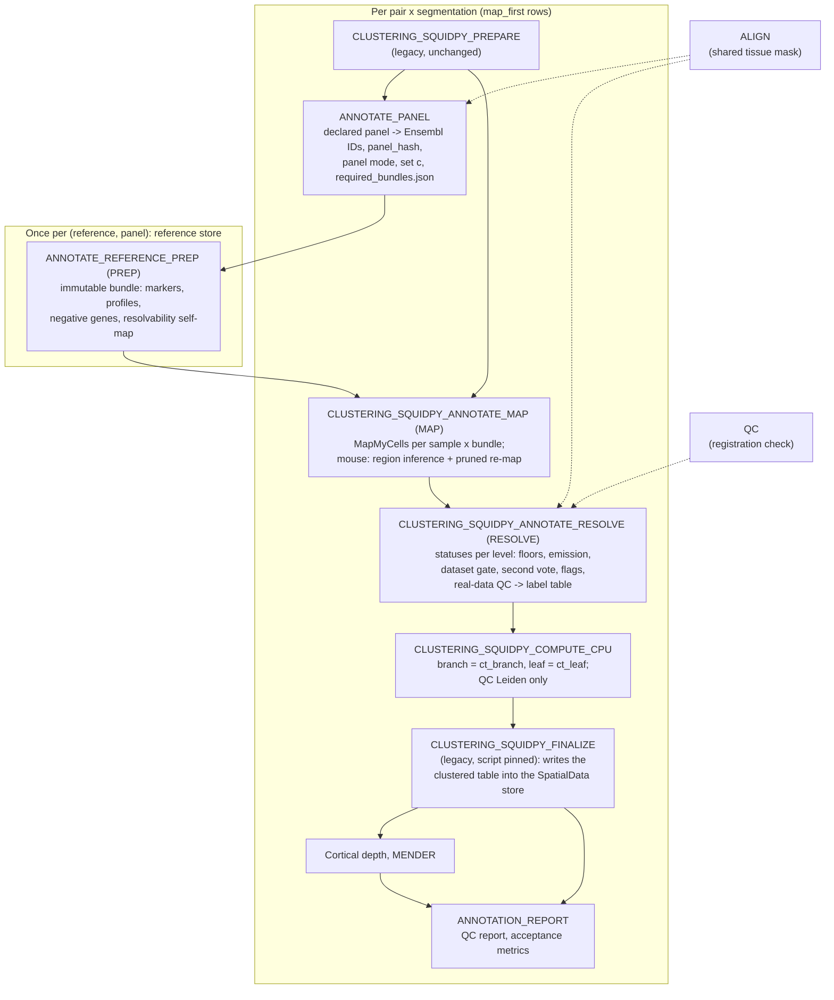

# Cell-type annotation: overview and method

This page explains the reference-based cell-type annotation that the
`feature/robust-celltype-annotation` integration branch adds to MerXen. It is
written for two readers:

- a **scientist who runs the pipeline** and wants to know what a label means
  and how far to trust it, and
- a **developer joining the code** who needs a map before reading the
  details.

[Part 1](#part-1-overview) is the overview: why the work exists, the flow of
stages, the modules, the outputs and how panels are trusted.
[Part 2](#part-2-how-each-cell-type-is-defined) gives the exact rule used to
define a cell type at every level, for human and for mouse, with a
[worked example](#25-worked-example-one-human-cell).

The detailed, milestone-by-milestone reference is
[Reference-based annotation](stages/annotation.md). The design and its
decisions are in the [implementation plan](plans/robust-celltype-annotation-plan.md),
and the thresholds that acceptance was scored against are in the
[pre-registration](acceptance/annotation-v1-preregistration.md). Where this
page and the code disagree, the code wins; the constants below were checked
against the branch at `ff49f5c`.

**Status in one paragraph.** Human runs use the new annotation by default
(`clustering_squidpy_mode = map_first`). Mouse runs still default to the
legacy annotation; a mouse `map_first` run works (standalone, or in the
pipeline, where it writes a separate `_mapfirst` table), but mouse
acceptance, the AP-axis rule hardening and the default switch are still to
come (see [What is pending for mouse](#what-is-pending-for-mouse)). A
`legacy` row calls none of the annotation processes, and a test pins the
legacy clustering script text, its wiring and its parameter defaults, so
legacy results and `-resume` are unchanged.

---

## Part 1. Overview

### 1.1 Why this exists

**The legacy annotation clusters first and names clusters second.** The
legacy Squidpy stage runs Leiden on each section, scores each broad cluster
against Allen marker sets, writes one `broad_class` per cluster, and then
re-clusters inside each broad class ([Squidpy clustering](stages/clustering-squidpy.md)).
Every cell in a cluster gets the cluster's label, whatever its own counts
say. On imaging panels of about 300 genes, where seven of the eight human sections'
proseg_hybrid cells have a pooled median of 33 counts (17 to 71 per section;
the set a dry run's expected depth, pre-registration §23.21), clusters follow
depth and segmentation quality as much as cell type. Measured
on the four human pairs, the legacy MERSCOPE and Xenium `broad_class`
compositions differed by a Jensen–Shannon distance of 0.51 / 1.00 / 0.66 /
0.44 (P7513 / P1212 / P7113 / P5011), and P1212's MERSCOPE section had no
neurons at all (plan §0). There was also no per-cell confidence, and no way
to say that a panel cannot separate two types at a given depth.

**The new design maps first.** Each cell is mapped on its own onto an Allen
reference taxonomy with MapMyCells (`cell_type_mapper`), using markers chosen
for the panel. Each cell then gets, at every level of the taxonomy, either a
confident label or a status that says why not. A level is only emitted
where an in-silico test on held-out reference cells (the *resolvability
self-map*) shows that this panel reaches the precision target for that class
at that depth. The clustering hierarchy (branch and leaf) is built from these
labels; Leiden is kept only as a QC embedding. On the same pairs, the
composition distance between platforms fell to about 0.13 / 0.14 (P7513 /
P1212), with 0.3–0.6% of calls to implausible types (plan §0). These numbers
are evidence quoted from the plan, not recomputed here.

The design rests on five principles:

1. **Per-cell, not per-cluster.** No cluster majority overrides a cell's own
   call.
2. **Every level has a status.** A cell is never silently unlabelled: it is
   `confident` or one of ten reasons (the [status table](#22-status-values)).
3. **Only emit what the panel can resolve.** Emission and thresholds are
   decided per (level, called class, depth bin) from simulation, and can only
   be made stricter for panels without real-data validation.
4. **Unknown panels fail safe.** A panel is `refused`, `broad_only`,
   `provisional` or `validated`; anything not validated is labelled with
   stricter targets and carries a banner.
5. **Real data can only downgrade.** Checks on the real dataset (marker
   consistency, registration, cross-platform concordance and others) can
   lower or withhold output, never raise trust.

### 1.2 The flow

| Step | Nextflow process / command | What it does | Caching |
|---|---|---|---|
| Panel | `ANNOTATE_PANEL` / `merxen annotation-panel` | Reads the *declared* gene list (vendor panel file, codebook or unfiltered H5AD `var`), removes controls, resolves symbols to Ensembl IDs, refuses bad panels, decides the panel mode (shared `intersection`, `per_platform` or `single_sample`), set c, and which bundles are needed. | normal |
| PREP | `ANNOTATE_REFERENCE_PREP` / `merxen annotation-reference-prep` | Builds or reuses one immutable bundle per (reference, panel) in a content-addressed store: the mapping precompute, the panel's marker lookup, reference profiles, negative genes and, for primary and secondary references, the resolvability self-map. | `cache false`; the store guarantees a single build |
| MAP | `CLUSTERING_SQUIDPY_ANNOTATE_MAP` / `merxen annotate` | Maps every table cell of every sample onto every bundle with fixed engine settings; writes one tidy row per cell × taxonomy level. Mouse adds the region step. Makes no final call. | `deep`; identical published runs are reused |
| RESOLVE | `CLUSTERING_SQUIDPY_ANNOTATE_RESOLVE` / `merxen annotate-resolve` | Turns the mappings into one label table per sample: per-level names, scores and statuses, the final label, the dataset gate, flags, composition and real-data QC. | `deep` + a fingerprint of the rule code, so a rule change re-runs RESOLVE only |
| Hierarchy | `CLUSTERING_SQUIDPY_COMPUTE_CPU` | Builds `hierarchical_cluster = "<branch>:<leaf>"` from the labels, fills the legacy-compatible columns, runs a QC-only Leiden. CPU only. | `deep` on the label files' content |
| Write-back | `CLUSTERING_SQUIDPY_FINALIZE` | The legacy process (script text pinned unchanged; it reads the table-key suffix from the table's `uns`): writes the clustered table into each platform's SpatialData store under a file lock. | as legacy |
| Report | `ANNOTATION_REPORT` / `merxen annotation-report` | Per pair × segmentation QC report (12 items) and `acceptance_metrics.json`. Never decides pass or fail. | normal + a fingerprint of the report code |

Reference prep can also run on its own (`--annotation_prepare_only`) to fill
the store before any sample is processed.

### 1.3 What lands where

All paths are under the run's `outdir` unless stated
([Outputs](outputs.md#annotation-reference-bundles-in-development) has the full list).

| Location | What it holds |
|---|---|
| `<pair>/<seg>/annotation_panel/annotation_panel_out/` | `panel_report.json` (gene-ID resolution, controls, panel mode, families), `panel_genes*.json`, `required_bundles.json`. |
| Reference store (`annotation_reference_store`, default `<outdir>/annotation_references`; panels > 1,000 genes in `annotation_reference_store_large`) | Bundles at `<store>/<reference_id>/<build_hash>/`, read-only, never deleted by the pipeline. `annotation_reference_prep/<reference_id>/<panel>/bundle_ref.json` in the outdir points at them. |
| `<pair>/<seg>/annotation_map/annotation_map_out/` | `<platform>/<sid>_mmc_<run_id>.parquet` (tidy MapMyCells output), `<platform>/<sid>_ct_provisional.parquet` (raw-threshold labels for inspection and the shadow evaluation only; no pipeline stage reads them), mouse `<sid>_mouse_regions.parquet` and the pruned re-map, `map_manifest.json`. |
| `<pair>/<seg>/annotation_resolve/annotation_resolve_out/` | **`<platform>/<sid>_celltype_labels.parquet`** (the label table: one row per segmented object), `<platform>/<sid>_annotation_manifest.json` (provenance), `<pair>_resolve_summary.json` (gate, trust, coverage, flags, compositions, cross-platform statistics, real-data QC). |
| `<pair>/<seg>/clustering_squidpy/clustering_squidpy_out/<platform>/` | `<sid>_clustered.h5ad`: table cells only, with every `ct_*` and `flag_*` column in `obs` plus the legacy-compatible columns. |
| `<pair>/<platform>/latest/latest_spatialdata.zarr` | The clustered table `tables/<source table>_clustering_squidpy[_<suffix>]`, e.g. `table_MOSAIK_proseg_hybrid_clustering_squidpy`. Human `map_first` writes the **unsuffixed** key, so it replaces a legacy table of the same segmentation; mouse `map_first` writes `..._clustering_squidpy_mapfirst` until the mouse default switches. |
| `<pair>/<seg>/annotation_report/annotation_report_out/` | `report.html`, figures, tables, `acceptance_metrics.json`. |

**What goes into the SpatialData table.** `obs` gets every `ct_*` column
(per level: `name`, `raw`, `conf`, `corr`, `runner_up`, `margin`, `status`,
`validated`; plus `ct_final_level`, `ct_final_name`, `ct_consensus_tier`,
`ct_branch`, `ct_leaf`, `ct_mender_state`), every `flag_*` column with its
continuous companion (`contamination_score`, `ood_z`, …), `exclude_hard`,
`discovery_caution` and `depth_bin`. The legacy-compatible columns are filled
from the labels: `broad_class`, `broad_atlas_label`, `neuron_split_label`,
`subcluster_label`, `subcluster_status`, `hierarchical_cluster`. The QC
Leiden is in `leiden` / `leiden_broad`. The soft composition vectors
(`soft_*`), the raw engine columns (`mmc_*`) and the likelihood columns
(`ll_*`) stay in the parquet only.
Provenance is in `uns["merxen_annotation_json"]` and
`uns["merxen_hierarchical_clustering"]` (mode, suffix, gate level, panel
trust, cross-platform scope).

**Which column to use.** For a cell type, use `ct_final_name` (the deepest
confident level), or `ct_<level>_name` **only where** `ct_<level>_status ==
"confident"`: the name column also holds the candidate name of cells that
failed a check (it is null only for `low_counts`, `not_applicable` and
`not_attempted_gate`). Use `exclude_hard` to drop objects, and
`discovery_caution` for sensitivity analyses.

### 1.4 Species at a glance

| | Human | Mouse |
|---|---|---|
| Primary reference | Whole Human Brain (WHB), frontal cortex subset, supercluster → cluster (`whb_frontal_supc_clus`) | Whole Mouse Brain (WMB), class → subclass → cluster, supertype dropped (`wmb_panel`) |
| Second reference | SEA-AD Multiregion (`seaad_mr_panel`): a second vote at the 7 broad classes, and a secondary subclass name | None (one method). A panel-independent MERFISH region-share bundle (`wmb_region_share`) drives region pruning |
| Chain of levels (`ct_final_level`) | lineage → broad → NT → **supercluster** (leaf) | broad → class → NT → **subclass** (leaf) |
| Levels outside the chain | SEA-AD subclass (secondary name, always written); WHB cluster (report-only, opt-in) | Supertype (report-only, opt-in) |
| Default thresholds | 0.73 (lineage, broad, NT), 0.69 (supercluster) | 0.90 (broad, class, NT), 0.80 (subclass) |
| Region handling | A fixed list of superclusters implausible in frontal cortex; only `frontal_cortex` is supported | Divisions present in the section are inferred from confident neurons; implausible nodes are dropped and those cells re-mapped |
| Dataset gate | Label-based: share of cells ≥ 30 counts, confident broad coverage | Label-free signals G1–G5 (registration, marker referee, implausibility, composition, spill-over) |
| Real-data QC | Yes (downgrade-only) | Not yet (planned) |
| Default mode | `map_first` | `legacy` (until the mouse switch) |

### 1.5 How far to trust a panel

A **panel** here is the declared gene list, resolved to Ensembl IDs and
identified by `panel_hash`. Panels that are the same set of IDs, or very
close to a known one (Jaccard ≥ 0.95 and containing all its root markers),
belong to one **panel family**. Trust is decided per family and per
reference, and has four states (`diagnostics.trust_state`):

| State | When | What it does to the labels |
|---|---|---|
| `validated` | The family is listed in `validated_panels.csv`. Today: the human 296/297-gene set a and its 264/265-gene set c (both platforms, up to supercluster), and the mouse ag7 (500 genes) and VZG2 (815 genes) MERSCOPE panels (up to subclass). All are validated on real data. | Pre-registered default thresholds, packaged count floors, `ct_<L>_validated = true` on confident labels up to the validated level. |
| `provisional` | Any other panel that passes the checks (custom panels, Xenium Prime 5K, the new-panel human MERSCOPE family, P5011's 268-gene MERSCOPE panel). | Stricter precision targets, thresholds that can only rise, floors that take the maximum of every known and simulated floor, a report banner and a dataset-gate warning. Labels are still emitted where the simulation allows. |
| `broad_only` | The simulation finds the leaf resolvable for fewer than half of the classes at every depth up to 250 counts; or a non-validated panel has no self-map (fail-safe). | The leaf level (supercluster / subclass) is never attempted. |
| `refused` | The gene list fails ID resolution (< 95% resolved), is the wrong species, has fewer than 50 genes in the reference or fewer than 10 root markers, or the simulation finds broad unresolvable at every depth up to 250 counts. | Primary reference: nothing is labelled, the dataset gate is `failed` (`panel_refused`) and every cell is `exclude_hard`. Secondary (SEA-AD): not mapped, and RESOLVE runs in the degraded `whb_only` mode (cells below 60 counts become `single_method`). |

**Gate P** is how a provisional family could become validated without real
ground truth. It is a stand-alone simulation programme (`merxen
annotation-panel-simulate --gate-p`, never part of a pipeline run): it
re-builds the self-map with three different held-out donors and two seeds,
adds stress tests (more contamination, noisier gene efficiencies,
cross-platform offsets) and scores nine pre-registered criteria (NP1–NP9;
NP3–NP7 per (level, class), NP1, NP2, NP8 and NP9 per family). Promotion
only happens through a reviewed PR that adds rows to the packaged
validation tables, and it changes only the
`ct_<L>_validated` flags, the banner and the gate warning, never an emitted
label. **No family has been promoted yet.** The new-panel human MERSCOPE
family was scored and did not pass (lineage failed the 1% excluded-call
criterion in 7 of 8 ensemble members), so it stays provisional. Gate P for
mouse is not available yet.

Two more safeguards act per dataset, whatever the panel:

- **The dataset gate** (`full` / `broad_only` / `failed`, plus a warning
  flag) decides whether the leaf levels (`broad_only`) or every level
  (`failed`) are left unattempted on this section.
- **Real-data QC** (human) checks the section against expectations that need
  no labels: marker consistency, registration, cross-platform concordance,
  flag rates, gene complexity versus simulation and others. It can only cap
  the gate, withhold a level or warn. On the seeded real-data family
  (set a) the marker, concordance, flag-rate, gene-complexity and prefilter
  checks only warn until gate H merges into `main`; the registration check
  can still fail the gate.

### 1.6 Module map

All annotation code lives in `src/merxen/annotation/`; the map-first
hierarchy lives in `src/merxen/clustering/`.

**Panels and references (PREP)**

| Module | Role |
|---|---|
| `panel.py` | Declared panels, control removal, `panel_hash`, panel mode, set c, panel families, `required_bundles.json`. |
| `gene_ids.py` | Gene-ID resolution (native ID → other platform → gene table → alias → curated override) and the species check. |
| `store.py` | Content-addressed, append-only reference store: `build_hash`, locking, atomic build, read-only bundles. |
| `reference.py` | Every bundle builder (WHB frontal, SEA-AD, WMB, region shares, held-out test sets), marker discovery, lookup validation, profiles, negative genes, the self-map driver. |
| `resolvability.py` | The self-map engine: test cells, thinning and contamination, level definitions, isotonic thresholds, the emission rule, the version-7 ensemble, floors, trust constraint, per-dataset re-decision. |
| `prefilter.py` | Opt-in marker prefilter for panels above 1,000 genes. |
| `sim_inputs.py` | Registry of simulation inputs derived from public vendor data (per-gene factors, depth profiles), with provenance. |
| `diagnostics.py` | Validation tables, panel diagnostics, the trust-state machine (`trust_state`, `TrustDecision`). |
| `simulate.py`, `public_panels.py` | `merxen annotation-panel-simulate` (predict what a gene list can resolve) and public vendor panel lists (`annotation-panel-fetch`). |
| `gate_p.py`, `gate_p_run.py` | Gate-P scoring (NP1–NP9) and its driver. |
| `memory.py` | Process-tree memory sampling for PREP and simulations. |

**Mapping (MAP)**

| Module | Role |
|---|---|
| `pipeline.py` | MAP and RESOLVE orchestration: query building, bundle selection, run reuse, the mouse region step call, manifests, label-table writing, human per-sample resolve. |
| `mapmycells_engine.py` | MapMyCells wrapper: command, environment, query fingerprint, lookup restriction, tidy table, coarse-class probability aggregation. |
| `mouse_regions.py` | Mouse region inference, two-tier drop rule, pruned lookup and re-map merge. |

**Labels (RESOLVE)**

| Module | Role |
|---|---|
| `consensus.py` | The per-level rules and status precedence (`resolve_human`, `resolve_mouse`), second vote, final label, consensus tier. |
| `thresholds.py` | Raw thresholds, count floors (`FloorPlan`), resolvability-gated emission (`EmissionPlan`), the human dataset gate. |
| `mouse_resolve.py`, `mouse_gate.py`, `mouse_flags.py` | Mouse RESOLVE, the label-free mouse gate G1–G5, mouse flags (microglial spill-over, region coherence). |
| `shadow.py` | SEA-AD 7-class calls used by the second vote, plus the shadow-evaluation code. |
| `real_qc.py`, `human_referee.py` | Downgrade-only real-data QC and the human marker referee. |
| `flags.py` | Report-only flags (contamination, diffuse profile, out-of-distribution). |
| `composition.py` | Soft composition, Jensen–Shannon distance, spatial block bootstrap. |
| `vocab.py`, `schema.py`, `provenance.py`, `config.py`, `samplesheet_columns.py` | Vocabularies, the label-table contract and `CellStatus`, provenance records, all configuration models and defaults, optional samplesheet columns. |
| `likelihood.py` | Count-likelihood typer kept for diagnostics only; it is not a vote. |

**Report and evaluation**

| Module | Role |
|---|---|
| `report.py`, `report_*.py` | The annotation QC report (items 1–12), its figures, metrics, HTML and panel card. `report_scoring.py` holds the scoring rules shared with the acceptance scripts. |
| `draw_spread.py`, `segmentation_compare.py` | Evidence helpers: spread of the self-map over simulation draws; comparison of two segmentations. |

**Hierarchy** (`src/merxen/clustering/`): `map_first.py` (branches, leaves,
legacy-compatible columns, `uns` records), `cellset.py` (table cell =
`total_counts ≥ min_counts`, shared with legacy), `representation.py` and
`stability.py` (QC Leiden and its subsample stability), `cross_platform.py`
(which cross-platform statements a pair supports). The clustered table keys
and their suffix are built in `src/merxen/table_keys.py`, kept equal to
`main.nf` by a test.

**CLI and workflow.** `src/merxen/cli/run_annotation.py` (`annotation-panel`,
`annotation-reference-prep`, `annotation-store`, `annotate`,
`annotate-resolve`), `run_annotation_panels.py` (`annotation-panel-simulate`,
`annotation-panel-fetch`), `run_annotation_report.py`.
`workflows/modules/annotation.nf` (the processes),
`workflows/subworkflows/annotation_references.nf`, `clustering_map_first.nf`,
`annotation_report.nf`, `workflows/lib/Annotation*.groovy` (mode choice,
preflight, arguments, code fingerprints, run summary; mirrored by Python and
kept equal by tests), `workflows/conf/annotation.config` (all parameters).

**Scripts.** `scripts/annotation/` holds asset builders
(`build_vocab_tables.py`, `build_sim_inputs.py`, `build_np5_depth_profile.py`,
`build_xplatform_stress.py`) and `remove_mapfirst_outputs.py` (moves a
map-first run's tables aside). `scripts/acceptance/` holds one-off scoring
scripts for the acceptance gates (`run_acceptance.py`, `resolve_criteria.py`,
`compare_legacy.py`, `new_panel.py`, the `m3c_*` and `shadow_*` studies and
others). They are not pipeline stages.

### 1.7 Where to find details

| Topic | Where |
|---|---|
| Bundles, `build_hash`, set c | [Reference bundles](stages/annotation.md#reference-bundles), [Set c](stages/annotation.md#set-c) |
| The self-map in full (recipes, versions 6 and 7) | [Resolvability self-map](stages/annotation.md#resolvability-self-map-m3b); plan §8.3 |
| Panels, gene IDs, families, trust | [Declared panels](stages/annotation.md#declared-panels-gene-ids-and-controls-m3b), [Panel families and trust states](stages/annotation.md#panel-families-diagnostics-and-trust-states-m3b); plan §8.1–§8.2 |
| Gate P and its first result | [Gate P](stages/annotation.md#gate-p-simulation-based-validation-of-a-panel-family-m13), [Gate P on the new-panel family](stages/annotation.md#gate-p-on-the-new-panel-human-merscope-family-m13); pre-registration §23 |
| Real-data QC | [Real-data QC](stages/annotation.md#real-data-qc-m3c-downgrade-only), [in RESOLVE](stages/annotation.md#real-data-qc-in-resolve-m13); plan §8.8 |
| MAP, mouse region step | [Mapping](stages/annotation.md#mapping-merxen-annotate), [Mouse region step](stages/annotation.md#mouse-region-step-m6) |
| RESOLVE and the rules | [Resolving](stages/annotation.md#resolving-merxen-annotate-resolve-m4), [Human rules](stages/annotation.md#human-rules-v1-consensusresolve_human-52), [Mouse rules](stages/annotation.md#mouse-rules-v1-consensusresolve_mouse-73-m6); plan §5, §7 |
| Pipeline wiring, table keys, MENDER | [Map-first clustering runs](stages/annotation.md#map-first-clustering-runs-m5), [Pipeline processes](stages/annotation.md#pipeline-processes) |
| Label-table columns | [Label table schema](outputs.md#label-table-schema-sid_celltype_labelsparquet) |
| Report | [Annotation report](stages/annotation.md#annotation-report-merxen-annotation-report-m7) |
| Parameters | [Configuration](configuration.md) |
| Acceptance thresholds and results | [Pre-registration](acceptance/annotation-v1-preregistration.md) §9 (thresholds), §15, §18–§20 (human acceptance), §21–§22 (version 7), §23 (new-panel family) |
| Known limitations | [Known limitations](stages/annotation.md#known-limitations) |

---

## Part 2. How each cell type is defined

### 2.1 Common machinery

Every level, for both species, is decided by the same building blocks. This
section defines them once; the per-level sections then say which values each
level uses.

#### Table cells and depth

- A **table cell** is a segmented object with `total_counts ≥ min_counts`
  after control features are removed (`clustering/cellset.py:select_table_cells`;
  `min_counts` is the clustering run's, default 10). Other objects are
  `low_counts` at every level and are not in the clustered table.
- **Depth** is the cell's `total_counts`. Its **depth bin** is the largest
  value of the bundle's depth grid that is ≤ its counts
  (`resolvability.depth_bin`). Grids: human panels ≤ 1,000 genes
  `10, 15, 30, 60, 120, 250`; mouse and panels > 1,000 genes
  `10, 20, 50, 100, 250, 500, 1000, 2000`; version-7 panels > 1,000 genes
  `10, 20, 50, 100, 150, 250, 350, 500, 700, 1000, 1400, 2000, 3000`. A cell
  deeper than the top value uses the top bin.

#### The mapping call and its confidence

MAP runs MapMyCells (`cell_type_mapper` 1.7.2, refused if another version is
installed) on raw counts restricted to the panel's genes, with fixed
settings: bootstrap factor 0.5, 100 iterations, seed 0, 6 worker processes
(the default; the count is part of the run's reuse key), 5 runner-ups
(`mapmycells_engine.MmcEngineParams`). MapMyCells walks the taxonomy from
the root. At each parent node, in each of 100 iterations it
draws half of that parent's markers, correlates the cell (log2 CPM over the
panel genes) with the mean profile of every leaf under the parent, and gives
one vote to the child holding the best leaf.

- **`bp`** (bootstrap probability) of a node = its votes / 100. This is the
  confidence measure of every node-level call (`ct_<level>_raw`).
- **Aggregated probability** of a coarser class (human lineage, broad, NT;
  mouse broad, NT) = bp of the assigned node + bp of the runner-ups (up to 5)
  in the same class, capped at 1 (`mapmycells_engine.aggregate_parent_probability`).
  The runner-up class is the other class with the most runner-up mass;
  margin = class probability − runner-up class probability.
- `avg_correlation` is recorded as `ct_<level>_corr` (report-only, except an
  optional mouse floor that is off by default).

In v1, `ct_<level>_conf = ct_<level>_raw`: the probabilities are not
calibrated.

#### Class keys

Emission, thresholds and floors are looked up for the **class the cell was
called into** (its class key), not its true class, which is unknown:

- **Human**: the "floor class" of the called WHB supercluster
  (`vocab.human_floor_class`): neurons by NT (`Exc`, `Inh`, `OtherNeuron`),
  glia by broad class (`Astro`, `Oligo`, `OPC`, `Immune` for microglia,
  `Vascular`, `Fibroblast`). At supercluster level the COP supercluster has
  its own key `COP`. A sink or region-implausible node has no key and is
  never emitted, except at lineage when SEA-AD rescues it (keyed by
  SEA-AD's floor class; see [Lineage](#lineage)).
- **Mouse**: the called WMB class (e.g. `01 IT-ET Glut`).

#### The resolvability self-map: which (level, class, depth) may be emitted

Built once per (reference, panel) at PREP (`reference._run_self_map`,
`resolvability.py`), stored in the bundle as `resolvability_cells.parquet`
(every simulated call) and `resolvability.parquet`.

1. **Test cells** are reference cells that took no part in building the
   markers they are mapped with. Human: the frontal-cortex cells of a
   held-out WHB donor (`auto` = H19.30.002, the donor with the fewest
   frontal cells), at most 1,000 per supercluster and 25,000 in total, with
   non-neuronal superclusters topped up from 14 other neocortical regions
   (COP cells from those regions are left out). They are mapped onto a
   held-out copy of the bundle built from the other donors
   (`whb_frontal_supc_clus_ho`), never onto the production bundle.
   Mouse: 11,913 pinned WMB cells (at most 10 per supertype) excluded from
   marker training, plus up to 30 per supertype of the non-neuronal classes.
2. **Simulation.** At each grid depth D, every test cell with at least D
   native counts is thinned to D counts with a per-gene efficiency
   (LogNormal(0, 0.8), normalised to its median), and contaminated with
   0.25·D counts drawn from a cell of another broad class (recipe
   `R1_contam_HO`). The truth stays the host cell's.
3. **Mapping** with exactly the production engine settings.
4. **Decision per (level, called class, depth bin)**, on simulated calls
   split into a fit half and a check half by a hash of the cell id:
   - an isotonic curve of correctness against bp is fitted on the fit half
     (needs ≥ 50 calls);
   - **t\*** = the lowest bp on a 0.005 grid, at or above the default
     threshold and at most 0.99, where the fitted precision reaches the
     target (`resolvability.local_threshold`);
   - the bin is **emitted** when, at the applied threshold, it has ≥ 50
     confident calls, a Wilson 95% lower bound (on the Kish effective n)
     ≥ target − 0.02, point precision ≥ target, and coverage (confident /
     called) ≥ 0.2 (`resolvability._rule_pass`).
   - Deep bins are often thin. When the deepest bin has too few calls to be
     judged, bins are pooled from the deep end into one "≥ D_P" set until
     the set can be judged; the unjudged bins from D_P upwards take its
     verdict, and those deeper than D_P are marked
     `resolvability_extrapolated`. A shallower bin with too few calls is not
     emitted, and a class with fewer than 50 test cells at every depth is
     never emitted.
5. **Regimes.** Each bin is decided three ways:
   - `validated`: base targets, the pre-registered default threshold, checked
     on all calls (used for real-data-validated families);
   - `provisional`: raised targets and t\*, checked out of sample (used for
     every other family);
   - `trust`: base targets and t\*, used only for the panel's trust
     constraint.

   | Level | Base target | Provisional target, bins < 60 counts | Provisional target, bins ≥ 60 |
   |---|---|---|---|
   | Human lineage, broad, NT; mouse broad, class, NT | 0.90 | 0.97 | 0.95 |
   | Human supercluster (and cluster); mouse subclass (and supertype) | 0.85 | 0.95 | 0.90 |

   (Provisional = min(base + 0.05, 0.97), or + 0.10 below 60 counts;
   `config.AnnotationThresholds.provisional_target`.)

**Two versions of the self-map exist** (`reference.panel_resolvability_version`):

- **Version 6**, a single simulation draw (R1 at seed 0), for the
  real-data-validated families (set a, set c, ag7, VZG2, and panels that
  inherit them) and for P5011's 268-gene MERSCOPE family, which is pinned to
  it (`resolvability_v6_pins.csv`).
- **Version 7** for every other family (custom panels, 5K panels, the
  new-panel human MERSCOPE family). Differences: grid values are total
  counts (host and contamination together thinned to exactly D);
  classes with fewer than 200 test cells are topped up before mapping; and
  emission is decided
  by an **ensemble of eight draws** (R1 at seeds 0 and 6–12; or six R1 plus
  two measured-efficiency R3 draws where a measured per-gene factor table
  exists, today only Xenium Prime 5K mouse). A bin is emitted when **E1**
  (the pooled calls of all members pass the rule above, each test cell
  counted once) **and E2** (every member emits it, or the members'
  precisions agree within max(0.03, 3.5 standard errors) with ≥ 10 calls each
  and the pooled Wilson bound clears its limit by one standard error) hold. A
  saturated-bp rule judges a set that has no t\* but whose fit-half calls
  are > 90% at bp = 1 at threshold 0.99. Finally a **monotone fill** emits a
  deeper bin when its own
  point precision and coverage pass (never for non-neuronal classes at
  ≥ 1,000 counts); filled bins are `resolvability_extrapolated`, and floors
  and trust ignore them (`resolvability.ensemble_decide`, `_monotone_fill`).

**RESOLVE re-decides per dataset.** The simulated calls are fixed in the
bundle, but the decisions are not simply copied: RESOLVE reweights the
simulated cells to the dataset's own soft composition per depth bin (weight
= dataset share / test-set share of the type, trimmed at 10× the median
positive weight of each tested set) and re-runs the same decision with the
bundle's recorded rule settings
(`resolvability.ResolvabilityTables.decisions`; config setting
`AnnotationResolvabilityConfig.reweight_to_composition`, default on). So a
class that is common in this section is judged on its own errors more than
in the test set.

#### The threshold applied to a cell

For a level L, a cell with class key c and depth bin d
(`thresholds.EmissionPlan.level`):

1. **Default** = the raw threshold of the level (human 0.73 for lineage,
   broad and NT, 0.69 for supercluster and cluster; mouse 0.90 for broad,
   class and NT, 0.80 for subclass and supertype), raised to the bundle's
   recorded default if that is higher.
2. **Validated regime** (a real-data-validated family, up to its validated
   level): the applied threshold is the default. **Provisional regime**: the
   applied threshold is max(default, t\* of (L, c, d)), so it can only rise.
3. The cell passes when `ct_<L>_raw ≥ threshold − 1e-6`
   (`schema.meets_threshold`; the tolerance absorbs float32 storage).
4. If (L, c, d) is not emitted, the cell is `not_resolvable` at L, whatever
   its probability.

The SEA-AD subclass is a secondary level with its own fixed thresholds (see
[its section](#sea-ad-subclass-secondary-name)).

#### Count floors

A floor is the minimum `total_counts` for a confident call of a class at a
level (`thresholds.FloorPlan.floor`). Every floor is at least the hard floor
(`min_counts`).

- **Real-data-validated families**, up to their validated level, use packaged
  floors per (level, class, platform): `floors_human.csv` (set a) and
  `floors_mouse.csv` (ag7, VZG2). A platform or class without a row falls
  back to the largest packaged floor of that class, with a warning.
- **Other families** use max(hard floor, the largest packaged floor of that
  class on any platform or panel, the simulated floor = the smallest depth
  emitted in the provisional regime), and mouse subclass (and supertype)
  floors are at least 60. The summary records a
  `floors_unknown_panel:<level>` warning, except for simulation-validated
  families, which use the same rule without one.

Human packaged floors (set a; MERSCOPE / Xenium, counts):

| Floor class | Broad (also NT) | Supercluster (also SEA-AD subclass, cluster) |
|---|---|---|
| Exc | 10 / 10 | 10 / 10 |
| Inh | 10 / 30 | 30 / 10 |
| OtherNeuron | 60 / 60 | 60 / 60 |
| Astro | 10 / 10 | 10 / 10 |
| Oligo | 10 / 10 | 10 / 10 |
| OPC | 10 / 10 | 120 / 120 |
| COP | – | 120 / 120 |
| Immune | 10 / 15 | 10 / 15 |
| Vascular | 10 / 10 | 10 / 30 |
| Fibroblast | 10 / 10 | 10 / 30 |

Mouse packaged floors (ag7 and VZG2, MERSCOPE): 20 counts at class (also used
at broad and NT) and 50 at subclass, for every WMB class.

#### The dataset gate

Computed per section before the leaf level is attempted
(`thresholds.dataset_gate` for human, `mouse_gate.evaluate_mouse_gate` for
mouse). The worst condition wins:

- `failed`: every level of every table cell becomes `not_attempted_gate`
  and `exclude_hard`.
- `broad_only`: the leaf level (and the secondary and fine levels) become
  `not_attempted_gate`; coarser levels are unaffected.
- `full`: everything is attempted.

A separate **warning flag** never lowers the level (e.g. a provisional
panel). The human and mouse conditions are given in the species sections.

#### Status precedence

At each level the checks run in a fixed order and **the first failing check
sets the status** (`consensus._StatusBuilder`). The order differs slightly
per level; each level section below lists it exactly.

### 2.2 Status values

| Status | Meaning | Name column |
|---|---|---|
| `confident` | Every check passed. Only these cells carry the level's label. | the label |
| `low_counts` | Not a table cell (`total_counts < min_counts`). Set at every level. | null |
| `not_attempted_gate` | The dataset gate (`broad_only` for the leaf, `failed` for everything), a refused or missing primary reference, or a missing secondary (SEA-AD subclass) stopped the level. | null |
| `not_applicable` | The level does not apply to the call: NT for a non-neuronal call. | null |
| `implausible` | Human: the called WHB supercluster is a sink or implausible for the region. Mouse: the broad name is outside the vocabulary, or the cell's original call was removed by region pruning and the re-map is not confident. | candidate |
| `parent_unresolved` | The parent level is not confident (the chain must be contiguous). | candidate |
| `below_floor` | `total_counts` is below the class × level (× platform) floor. | candidate |
| `not_resolvable` | The self-map does not emit this (level, class, depth bin) for this dataset, or real-data QC withheld the level, or (mouse) the node has no supporting markers. | candidate |
| `low_confidence` | No call, or the probability is below the applied threshold, or (human broad) the COP rule failed at ≥ 120 counts. | candidate |
| `method_disagree` | Human: SEA-AD did not agree below 60 counts, or confidently called another class from 60 counts; SEA-AD subclass: SEA-AD's class differs from the WHB broad class. | candidate |
| `single_method` | Human: below 60 counts with no usable SEA-AD run (degraded mode `whb_only`), unless `annotation_allow_single_method` is set. | candidate |

"Candidate" means `ct_<level>_name` still shows what the mapper called, for
inspection; it is not a label.

### 2.3 Human levels

**Engines.** The primary is WHB frontal cortex (`whb_frontal_supc_clus`):
the WHB precompute restricted to the frontal regions A44-A45, A46, A32 and
ACC (653 subclusters, 125,481 cells), truncated to supercluster → cluster, with
panel markers (30 per utility). The cell's leaf call is the WHB
**supercluster** (31 superclusters; `whb_supercluster_vocab.csv` maps each to
a lineage, a broad class and an NT). The secondary is SEA-AD Multiregion
(`seaad_mr_panel`; class → subclass → supertype), which gives a 7-class label
and a subclass.

**Plausibility in frontal cortex.** Of the 31 superclusters, 14 are
plausible: seven neuronal (Upper-layer intratelencephalic, Deep-layer
intratelencephalic, Deep-layer near-projecting, Deep-layer corticothalamic
and 6b, MGE interneuron, CGE interneuron, LAMP5-LHX6 and Chandelier) and
seven non-neuronal (Oligodendrocyte, Committed oligodendrocyte precursor
(COP), Oligodendrocyte precursor, Astrocyte, Microglia, Vascular,
Fibroblast). The two **sinks** (Miscellaneous, Splatter) and the
region-implausible superclusters (hippocampal CA1-3, CA4 and dentate gyrus,
amygdala excitatory, medium spiny and eccentric medium spiny neurons,
mammillary body, thalamic excitatory, midbrain-derived inhibitory, upper and
lower rhombic lip, cerebellar inhibitory, ependymal, Bergmann glia, choroid
plexus) are **implausible**. Only `frontal_cortex` has this column, and the
pipeline refuses any other human region.

**SEA-AD second vote** (`consensus._second_votes`; mode `whb_sea`). SEA-AD's
7-class label is the broad class of its assigned subclass ("VLMC &
Perivascular" split by supertype into Fibroblasts or Vascular cells). Its
class probability is the class-level bp for neurons, and class bp × the
summed same-class subclass mass for other classes (`shadow.seaad_broad_calls`).
SEA-AD is *confident* when its label is one of the 7 classes and its
probability ≥ 0.68 (`seaad_broad`).

- **Below 60 counts**, the level passes only if SEA-AD's label agrees (at
  lineage, through the lineage of SEA-AD's class; at broad, the same class).
  No SEA-AD probability threshold applies, but a missing or
  out-of-vocabulary SEA-AD label does not agree.
- **From 60 counts**, the level fails only if SEA-AD is confident and calls a
  different lineage / class.
- If SEA-AD is missing or refused (mode `whb_only`), cells below 60 counts
  are `single_method` (unless `annotation_allow_single_method`), and cells
  from 60 counts pass. If WHB is missing or refused, every table cell is
  `not_attempted_gate`.
- The SEA-AD bundle's own self-map (a 7-class level at 0.68) only sets its
  trust state; it does not gate WHB levels.

The four chain levels follow. In each check list, "no call" means MapMyCells
gave no supercluster.

#### Lineage

- **Labels**: Neurons, Oligodendrocyte lineage, Astrocytes, Microglia,
  Vascular cells, Fibroblasts (the vocabulary lineage of the called
  supercluster).
- **Confidence**: aggregated WHB probability of the called supercluster's
  lineage (bp + same-lineage runner-ups).
- **Threshold**: 0.73 (validated) or max(0.73, t\*) (provisional), from the
  lineage table for the cell's floor class.
- **Floor**: the hard floor (`min_counts`, 10 by default).
- **Cross-reference**: the SEA-AD vote at lineage. **Rescue:** an implausible
  supercluster keeps its lineage when SEA-AD agrees at lineage; its class key
  is then SEA-AD's floor class.
- **Check order**: `low_counts` → `low_confidence` (no call) → `implausible`
  (implausible node, not rescued) → `implausible` (lineage outside the six)
  → `below_floor` → `not_resolvable` → `low_confidence` (probability) →
  `single_method` / `method_disagree` (vote).

#### Broad

- **Labels** (7 classes): Neurons, Astrocytes, Oligodendrocytes,
  Oligodendrocyte precursors, Microglia, Vascular cells, Fibroblasts.
- **Confidence**: aggregated WHB probability of the called supercluster's
  broad class.
- **Threshold**: 0.73 or max(0.73, t\*), from the broad table.
- **Floor**: the broad floor of the floor class and platform (table above;
  e.g. Inh on Xenium 30, OtherNeuron 60).
- **Parent**: lineage confident.
- **Cross-reference**: the SEA-AD vote at the 7 classes.
- **COP rule.** A call to the COP supercluster belongs to broad
  "Oligodendrocyte precursors" only when (counts ≥ the COP floor, 120, **and**
  supercluster bp ≥ the supercluster threshold for key COP) **or** SEA-AD
  confidently calls OPC. Otherwise the cell stays at lineage
  (`below_floor` under 120 counts, `low_confidence` from 120), and
  `flag_cop_suppressed` is set. The rule exists because WHB over-calls COP
  on short panels (plan D-A6).
- **Check order**: `low_counts` → `low_confidence` (no call) → `implausible`
  (implausible node, even when rescued at lineage) → `parent_unresolved` →
  `implausible` (broad outside the 7) → `below_floor` → `not_resolvable` →
  `low_confidence` (probability) → COP rule (`below_floor` /
  `low_confidence`) → `single_method` / `method_disagree`.

#### NT (neurotransmitter)

- **Labels**: Excitatory, Inhibitory. Neurons only.
- **Confidence**: aggregated WHB probability of the called supercluster's NT,
  over neuronal superclusters only.
- **Threshold**: 0.73 or max(0.73, t\*), from the NT table.
- **Floor**: the broad floor of the class (so the same as broad).
- **Parent**: broad confident. No second vote.
- **Check order**: `low_counts` → `low_confidence` (no call) →
  `not_applicable` (lineage is not Neurons) → `implausible` →
  `parent_unresolved` → `below_floor` → `not_resolvable` → `low_confidence`.

#### Human dataset gate

Computed on the table cells after broad and before the leaf
(`thresholds.dataset_gate`):

| Condition | Effect |
|---|---|
| Confident broad coverage of table cells < 0.25 | `failed` |
| Primary panel trust `refused` | `failed` (`panel_refused`) |
| A = share of table cells with ≥ 30 counts < 0.30 | `broad_only` |
| Primary panel trust `broad_only` | `broad_only` (`panel_broad_only`) |
| Real-data QC gate cap (marker consistency < 0.70 → `broad_only`; registration G1 fail → `failed`) | lowers only |
| Confident broad / all segmented objects < 0.15 | warning |
| Provisional primary panel | warning (and banner) |
| A simulation-validated family with > 10% of confident labels outside its validated region at a chain level | warning |

For example, P1212 and P5011 MERSCOPE are `broad_only` because fewer than
30% of their table cells reach 30 counts (plan D-C3).

#### Supercluster (the leaf)

- **Labels**: the 14 plausible superclusters.
- **Confidence**: the supercluster bp.
- **Threshold**: 0.69 or max(0.69, t\*), from the supercluster table (COP has
  its own key).
- **Floor**: the supercluster floor (e.g. OPC and COP 120, Inh on MERSCOPE
  30).
- **Parent**: NT confident for neurons, broad confident otherwise. (Plan
  §5.2 asked only for broad; requiring NT keeps the chain contiguous.)
- **Gate**: not attempted unless the gate is `full`.
- **Check order**: `low_counts` → `not_attempted_gate` → `low_confidence`
  (no call) → `implausible` → `parent_unresolved` → `below_floor` →
  `not_resolvable` → `low_confidence`.

#### SEA-AD subclass (secondary name)

Never part of `ct_final`; it gives a second, finer name from a disease-aware
reference.

- **Labels**: SEA-AD subclasses (e.g. L5 IT, Sst, Astrocyte).
- **Confidence**: the SEA-AD subclass `aggregate_probability` (class bp ×
  subclass bp).
- **Threshold**: fixed, 0.55 below 60 counts and 0.45 from 60 (never
  raised).
- **Emission and floor**: borrowed from the WHB supercluster table and floor
  of the cell's WHB floor class.
- **Parent**: WHB broad confident; SEA-AD's 7-class label must equal the WHB
  broad class (its `method_disagree`).
- **Check order**: `low_counts` → `not_attempted_gate` (SEA-AD not used, or
  gate not `full`) → `low_confidence` (no SEA-AD subclass) →
  `parent_unresolved` → `below_floor` → `not_resolvable` → `low_confidence`
  → `method_disagree`.

#### WHB cluster (fine level, opt-in)

Only with `annotation_allow_fine_levels`, report-only, never a leaf or in
`ct_final`. Confidence: the cluster bp; threshold as supercluster (0.69 or
higher); floor: the supercluster floor; parent: supercluster confident. It is
emitted only if the self-map's seed-1 rerun changes ≤ 2% of its confident
labels (`fine_level_seed_stability`), and never without a self-map. Check
order as for supercluster.

#### Real-data QC (human)

After a first, QC-free resolution, `real_qc.real_data_qc` scores the section
(details in [Real-data QC in RESOLVE](stages/annotation.md#real-data-qc-in-resolve-m13)).
If a check caps the gate lower than it was, or withholds a level, RESOLVE
runs again with that effect: a withheld level becomes `not_resolvable`. The
checks include marker consistency (warn < 0.75, cap `broad_only` < 0.70),
registration G1 (fail when the density ratio < 1.5 or the shift > 5 µm →
gate `failed`), paired cross-platform concordance (soft broad JSD > 0.20 →
supercluster-level pair statistics withheld; labels unchanged), flag rates,
gene complexity and, for version-7 bundles, coverage versus the simulation's
prediction. On set a (a seeded real-data family) the marker, concordance,
flag-rate, gene-complexity and prefilter checks only warn until the human
species gate (gate H) merges into `main`; G1 can still fail the gate (as in
[1.5](#15-how-far-to-trust-a-panel)). Checks that need inputs RESOLVE
does not have (no registration file, no prefilter) are recorded
`not_evaluable`.

### 2.4 Human final label, hierarchy, tier and flags

- **`ct_final_level` / `ct_final_name`** (`consensus.final_label`): the
  deepest confident level along lineage → broad → NT → supercluster; `none` /
  `Mixed/Unknown` when no level is confident. Because each level requires
  its parent, the confident levels always form a contiguous chain from
  lineage.
- **`ct_branch`** (`pipeline.human_branch_columns`): the confident broad
  class, with neurons split into `Neurons/Excitatory`,
  `Neurons/Inhibitory` or `Neurons/unresolved`. A cell confident only at
  lineage gets `Neurons/unresolved` or `Oligodendrocyte lineage/unresolved`
  (other lineages give `Mixed/Unknown`).
- **`ct_leaf`**: the confident supercluster, else `unresolved`. In the
  clustered table every leaf is `unresolved` when the gate is `broad_only` or
  `failed` or the panel is `broad_only` / `refused`, and on `Mixed/Unknown`
  branches. `hierarchical_cluster = "<branch>:<leaf>"`; `ct_mender_state =
  ct_branch`.
- **`ct_consensus_tier`**: agreement of the informative methods at the 7
  classes. WHB is informative when it has a plausible call with broad
  probability ≥ 0.73; SEA-AD when confident (≥ 0.68). Tier 2 = both agree,
  1 = only one informative, 0 = both informative and disagree, −1 = none
  informative (also outside the table). It measures agreement, not accuracy,
  and is independent of the statuses.
- **`ct_<L>_validated`**: confident and inside the family's validated region
  (all confident labels up to supercluster for set a; always false on a
  provisional family).
- **Status-mirroring flags**: `flag_low_counts`, and `flag_below_floor`,
  `flag_method_disagree`, `flag_implausible` when the deepest attempted chain
  status (ignoring `low_counts`, `not_attempted_gate`, `not_applicable`,
  `parent_unresolved`) is that status.
- **`exclude_hard`**: outside the table; or every chain status is
  `implausible` / `not_applicable` / `not_attempted_gate` with at least one
  `implausible`; or the gate failed.
- **Report-only flags** (`flags.py`; never change a status):
  `flag_contaminated` (counts on the class's negative genes against a
  dataset-fitted null), `flag_diffuse_profile`, `flag_ood` (robust z of
  `avg_correlation` < −3), and `flag_nonneuronal_high_depth` (version 7).
  `discovery_caution` = any of contaminated, diffuse, OOD or method
  disagreement.

### 2.5 Worked example: one human cell

*All numbers in this example are made up for illustration.*

A Xenium cell from a same-panel human pair (set a family: `validated` trust,
resolvability version 6), segmentation proseg_hybrid. After control removal
it has **85 counts**, so it is a table cell (≥ 10) in depth bin **60**.

**MAP output.** WHB supercluster: *Deep-layer intratelencephalic*, bp 0.81;
runner-ups *Upper-layer intratelencephalic* 0.11, *Deep-layer
near-projecting* 0.04, *MGE interneuron* 0.03, *Astrocyte* 0.01. SEA-AD:
7-class label Neurons with probability 0.97; subclass *L5 IT* with
`aggregate_probability` 0.58.

**Derived probabilities.**

| Level | Group of the call | Sum | Raw |
|---|---|---|---|
| Lineage | Neurons: 0.81 + 0.11 + 0.04 + 0.03 | 0.99 | 0.99 |
| Broad | Neurons: same superclusters | 0.99 | 0.99 |
| NT | Excitatory: 0.81 + 0.11 + 0.04 (MGE is Inhibitory) | 0.96 | 0.96 |
| Supercluster | bp of the call | – | 0.81 |

Class key: `Exc` (a neuronal, excitatory supercluster).

**The section.** 58% of its table cells have ≥ 30 counts and 71% are
confident at broad, so the gate is `full` with no warning.

**Level by level.**

| Level | Checks | Status, name |
|---|---|---|
| Lineage | table ✓; call ✓; plausible ✓; floor 10 ✓; (lineage, Exc, 60) emitted ✓; 0.99 ≥ 0.73 ✓; 85 ≥ 60, so SEA-AD can only veto, and it says Neurons ✓ | `confident`, Neurons |
| Broad | parent ✓; Neurons is one of the 7 ✓; broad floor Exc Xenium 10 ✓; emitted ✓; 0.99 ≥ 0.73 ✓; not COP; no veto ✓ | `confident`, Neurons |
| NT | lineage Neurons, so applicable ✓; parent ✓; floor 10 ✓; emitted ✓; 0.96 ≥ 0.73 ✓ | `confident`, Excitatory |
| Supercluster | gate `full` ✓; parent NT ✓; floor 10 ✓; (supercluster, Exc, 60) emitted ✓; 0.81 ≥ 0.69 ✓ | `confident`, Deep-layer intratelencephalic |
| SEA-AD subclass | SEA-AD used, gate `full` ✓; WHB broad ✓; floor 10 ✓; emitted ✓; 0.58 ≥ 0.45 (from 60) ✓; SEA-AD class Neurons = WHB broad ✓ | `confident`, L5 IT |

**Result.** `ct_final_level = supercluster`, `ct_final_name = Deep-layer
intratelencephalic`; `ct_branch = Neurons/Excitatory`, `ct_leaf =
Deep-layer intratelencephalic`, `hierarchical_cluster =
"Neurons/Excitatory:Deep-layer intratelencephalic"`;
`ct_consensus_tier = 2` (WHB 0.99 ≥ 0.73 and SEA-AD 0.97 ≥ 0.68 agree);
`ct_<L>_validated` true at all four chain levels.

**What changes if…**

- **…the cell had 25 counts and SEA-AD said Astrocytes (probability 0.75).**
  Below 60 counts SEA-AD must agree, so lineage is `method_disagree`; broad,
  NT, supercluster and SEA-AD subclass are `parent_unresolved`.
  `ct_final_name = Mixed/Unknown`, `flag_method_disagree = true`, `ct_consensus_tier = 0`
  (two informative methods disagree).
- **…the panel were provisional** (e.g. the new-panel human MERSCOPE family,
  version 7). Targets rise to 0.95 for lineage, broad and NT and 0.90 for
  supercluster at bin 60. If the ensemble's t\* for (supercluster, Exc, 60)
  were 0.86, the applied threshold would be max(0.69, 0.86) = 0.86, and 0.81
  fails: supercluster is `low_confidence`, `ct_final_name = Excitatory` (NT),
  `ct_leaf = unresolved`. Every `ct_<L>_validated` is false and the gate
  carries the `panel_provisional` warning.
- **…the section were `broad_only`** (A < 0.30). Supercluster and SEA-AD
  subclass are `not_attempted_gate`; the cell ends at NT.
- **…WHB had called COP** at 85 counts (with SEA-AD saying Oligodendrocytes:
  its Neurons call at 0.97 would veto the Oligodendrocyte lineage from 60
  counts). 85 < 120, so the COP rule fails unless SEA-AD confidently says
  OPC; broad would be `below_floor` (the broad OPC floor of 10 passes; the
  COP floor decides), and the cell would end at lineage (Oligodendrocyte
  lineage) with branch `Oligodendrocyte lineage/unresolved` and
  `flag_cop_suppressed = true`.

### 2.6 Mouse

Mouse uses one method: MapMyCells on WMB (`wmb_panel`). The marker lookup is
built from at most 50 WMB 10Xv3 cells per cluster (seed 1, self-map test
cells excluded); the mapping means are the validated Allen precompute
(`precomputed_stats_ABC_revision_230821.h5`); the supertype level is dropped,
so the mapped levels are class → subclass → cluster. There is no second vote
(`ct_consensus_tier` is 1 when the class bp ≥ 0.90, else −1;
`flag_method_disagree` is always false).

#### Region step (in MAP)

Mouse plausibility depends on where the section is, so MAP infers it
(`mouse_regions.py`, rule variant `v1`):

1. **Request** per sample: `auto` (default), `none`, or a `;`-separated list
   of CCF divisions (Isocortex, OLF, OB, HPF, CTXsp, STR, PAL, TH, HY, MB, P,
   MY, CB) from the samplesheet column `mouse_section_regions`, the
   parameter, or the CLI.
2. **Voters**: confident neurons, i.e. WMB classes 01–29 with class bp and
   subclass bp both ≥ 0.9. Each votes for its subclass's *home division*,
   the division holding most of that subclass's MERFISH cells (OB split from
   OLF).
3. **Tiles** of 150 µm with ≥ 3 voters get their majority home. A division
   is present when it holds ≥ 1% of assigned tiles and its largest
   8-connected component has ≥ 3 tiles. With < 200 assigned tiles (or no
   coordinates) pruning is skipped with a warning.
4. **Two-tier drop rule.** For each class outside the never-drop classes (25
   Pineal Glut, 30 Astro-Epen, 31 OPC-Oligo, 33 Vascular, 34 Immune): the
   class is *absent* if < 20% of its grey-matter MERFISH cells lie in the
   present divisions (and it has ≥ 100 such cells). A subclass with ≥ 20
   MERFISH cells is dropped when its present share is < 30% (in an absent
   class) or < 10% (otherwise); a smaller subclass is dropped only in an
   absent class; a class whose subclasses are all dropped is dropped whole.
5. **Re-map.** Only cells whose original class or subclass was dropped are
   mapped again with those nodes removed. All other cells keep their
   original call and bp.

#### Mouse levels

| Level | Labels | Confidence | Threshold | Floor (ag7 / VZG2) | Parent | Check order |
|---|---|---|---|---|---|---|
| Broad | Neurons, Astrocytes/Ependymal, Oligodendrocyte lineage, OEC, Vascular cells, Microglia | class bp + same-broad runner-ups | 0.90 or max(0.90, t\*) | class floor, 20 | – | `low_counts` → `low_confidence` (no call) → `implausible` (broad name outside the 6) → `below_floor` → `not_resolvable` → `low_confidence` |
| Class | 34 WMB classes (e.g. `01 IT-ET Glut`) | class bp | 0.90 or max(0.90, t\*) | 20 | broad | `low_counts` → `low_confidence` (no call) → `parent_unresolved` → `below_floor` → `not_resolvable` (not emitted, or a marker-unsupported node) → `low_confidence` (bp; then `avg_correlation` if a floor is configured, none by default). Then: a cell whose class was region-dropped and is not confident after re-map → `implausible` |
| NT | Excitatory, Inhibitory, Other (neurons only) | class bp + same-NT runner-ups | 0.90 or max(0.90, t\*) | class floor, 20 | class | `low_counts` → `low_confidence` → `not_applicable` → `implausible` (region-dropped class) → `parent_unresolved` → `below_floor` → `not_resolvable` → `low_confidence` |
| Subclass (leaf) | WMB subclasses | subclass bp | 0.80 or max(0.80, t\*) | 50 (≥ 60 when not validated) | NT for neurons, else class | `low_counts` → `not_attempted_gate` (gate not `full`) → `low_confidence` (no call) → `implausible` → `parent_unresolved` → `below_floor` → `not_resolvable` (also marker-unsupported) → `low_confidence`. Then: a re-mapped cell that ends `below_floor`, `not_resolvable` or `low_confidence` → `implausible` |
| Supertype (opt-in, report-only) | WMB supertypes | bp | 0.80 or max(0.80, t\*) | subclass floor | subclass | as subclass; see the caveat below |

Emission, the version-7 ensemble, the composition reweighting and the
regimes work as described in [2.1](#21-common-machinery), with the WMB class
as the class key. Mouse targets: 0.90 at broad, class and NT; 0.85 at
subclass.

#### Mouse dataset gate (label-free, before any status)

| Signal | Fails the gate when | Warns when |
|---|---|---|
| G1 registration (the QC stage's check; required in pipeline runs) | density ratio < 1.5 or shift > 5 µm | ratio < 2.0, or no check |
| G2 marker referee (marker-derived pseudo-labels vs class calls) | consistency < 0.70 | < 0.80, or < 200 pseudo-labelled cells |
| G3 implausibility (share of table cells whose *unpruned* subclass has < 25% of its MERFISH cells in the present divisions; subclasses with ≥ 20 MERFISH cells, never-drop classes excluded) | – | > 3% |
| G4 composition vs a MERFISH window | – | Astro-Epen off by > 5 points or Immune by > 1 point (not evaluated unless sections are given) |
| G5 microglial spill-over flag rate | – | > 15% |

Panel trust caps the level as for human (`refused` → `failed`, `broad_only`
→ `broad_only`), and a provisional panel warns. After `resolve_mouse` the
gate is evaluated again so that a simulation-validated family warns when
> 10% of confident chain labels fall outside its validated region (the level
cannot change). Unlike human, no coverage signal can fail or restrict the
mouse gate.

#### Mouse final label and hierarchy

`ct_final_*` is the deepest confident level of broad → class → NT →
subclass. `ct_branch = ct_mender_state` = the confident class (else
`Mixed/Unknown`), `ct_leaf` = the confident subclass (else `unresolved`). In
the hierarchy, a class branch with fewer than 50 table cells loses its
leaves. Mouse-only report flags: `flag_microglial_spillover` (on by default
for mouse), `flag_region_incoherent`, `flag_astro_lowcount` (Astro-Epen
below 100 counts).

#### What is pending for mouse

- **Default switch and acceptance.** Mouse runs `legacy` by default; a
  `map_first` mouse run writes the `_mapfirst` table beside the legacy one.
  The pre-registered mouse criteria (MO1–MO11) have not been scored as an
  acceptance (plan §14, milestone M9).
- **AP-axis validation and rule hardening** (milestone M6b, on an unmerged
  branch): an AP estimate per section, G4 windows for all sections, rule
  variants. Until then G4 is not evaluated by default and only rule variant
  `v1` is accepted.
- **Mouse real-data QC and gate P** (milestone M13b): not run; gate P
  refuses mouse families until a second disjoint WMB test draw exists.
- **Validated mouse families are MERSCOPE only** (ag7, VZG2). A mouse Xenium
  or new panel runs in the provisional regime.

### 2.7 Points to keep in mind

- **Thresholds are re-derived per dataset.** The simulated calls and rule
  constants come from the bundle, but emission and t\* are re-decided for
  each section's composition. Only the validated regime applies the fixed
  defaults (0.73 / 0.69 human, 0.90 / 0.80 mouse), and even there emission
  per (class, bin) is re-judged.
- **Version 7 carries a known stability caveat.** The eight-member ensemble
  and its one-standard-error margin come from an amendment
  (pre-registration §22.2–§22.3) whose pre-registered stability re-test
  failed (emitted-triple churn 0.050 > 0.02 on the 5K mouse bundle; §22.7).
  The user accepted version 7 as amended on 2026-10-01, with that test
  reported rather than scored (§22.8); some code comments still describe the
  amendment as pending confirmation. Every family outside the validated and
  pinned ones runs on version 7.
- **Human does not use `marker_unsupported_nodes`** yet (nodes below an
  auto-collapsed parent); only mouse marks them `not_resolvable`.
- **The mouse supertype level is probably always `low_confidence`** when
  enabled: RESOLVE reads the supertype call from a `CCN20230722_SUPT` level
  of the tidy table, but `wmb_panel` maps with that level dropped, so every
  attempted table cell has no call (the self-map instead scores supertype by
  aggregating cluster calls). This follows from the code; no run has shown
  it. The level is off by default and report-only.
- **Region pruning is conservative at mouse class level**: cells that are not
  re-mapped keep their original bp, which still counts votes for dropped
  nodes (about 1.3% of ag7 and 0.7% of VZG2 table cells would be
  class-confident only after a full re-map, per the stage docs).
- **The consensus tier uses the fixed default** (0.73 human broad, 0.90
  mouse class), not the raised per-cell threshold, so tier 1 or 2 can sit on
  a cell that is not confident.
- **`flag_nonneuronal_high_depth` never fires** on bundles whose grid ends
  below 1,000 counts (e.g. the new-panel human MERSCOPE family's WHB bundle,
  grid ending at 250).
- **Nothing here re-runs the evidence.** Measured numbers quoted on this page
  (JSDs, coverage, gate-P result) come from the plan, the stage docs and the
  pre-registration.
